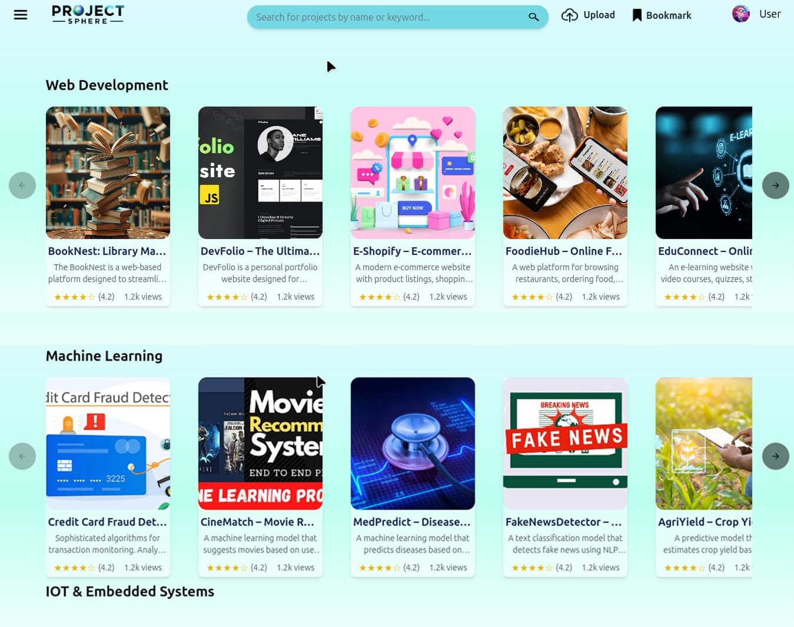
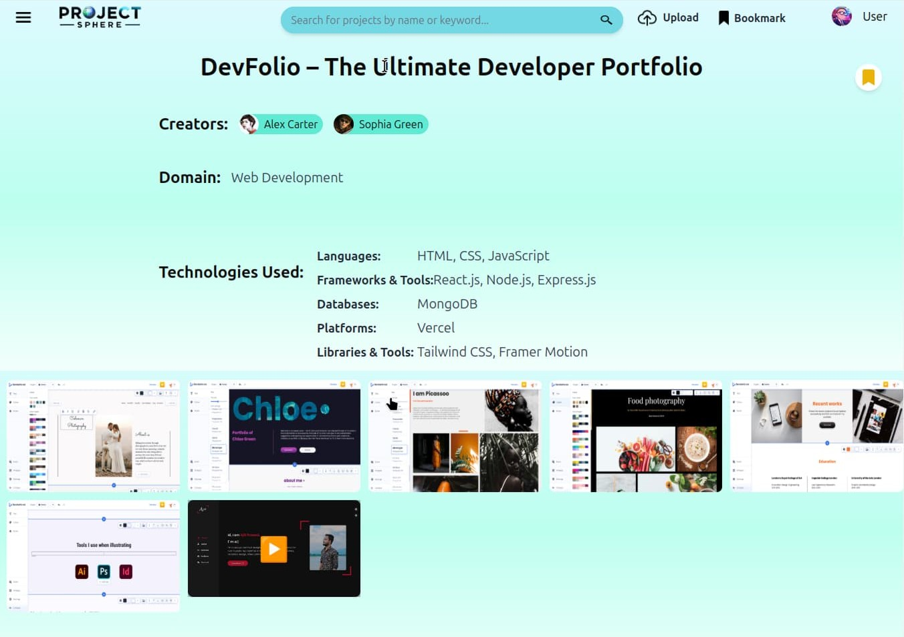
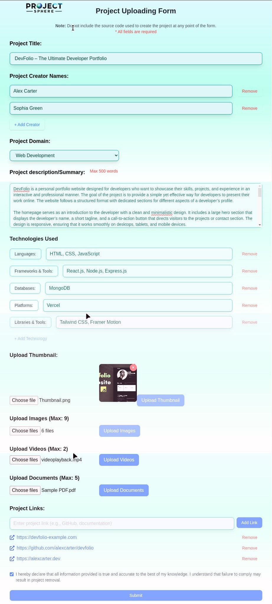
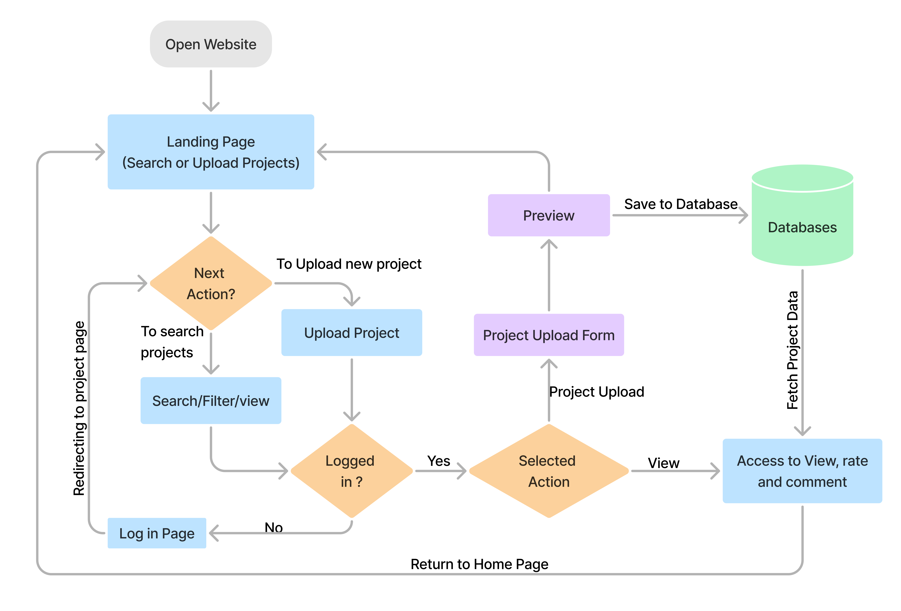

# 🚀 ProjectSphere

A collaborative platform to showcase and explore academic student projects across various domains.  
ProjectSphere allows students to submit their project abstracts, research papers, and model snapshots — while preventing plagiarism by excluding raw code uploads.

---

## 🔧 Features

- 🧠 Categorized project listings by academic domain (AI/ML, Data Science, Web Dev, etc.)
- 🔍 Search and filter functionality
- 📄 PDF uploads for research/project reports
- 🖼️ Images of working models or final products
- 💬 Peer reviews and rating system (stored using Supabase)
- ✨ ShadCN UI and TailwindCSS for clean design

---

## 🖼️ Screenshots


### Login Page  


---

### Home Page  


---

### Project Page  


---

### Form  


---

### Flowchart  


---

## 💡 Tech Stack

- **Frontend**: React.js / Next.js
- **Styling**: TailwindCSS + ShadCN UI
- **Backend/Storage**: Supabase
- **Auth**: Supabase Auth

---

## ⚙️ Getting Started

```bash
git clone https://github.com/DavidCoder05/ProjectSphere.git
cd ProjectSphere
npm install
npm run dev

